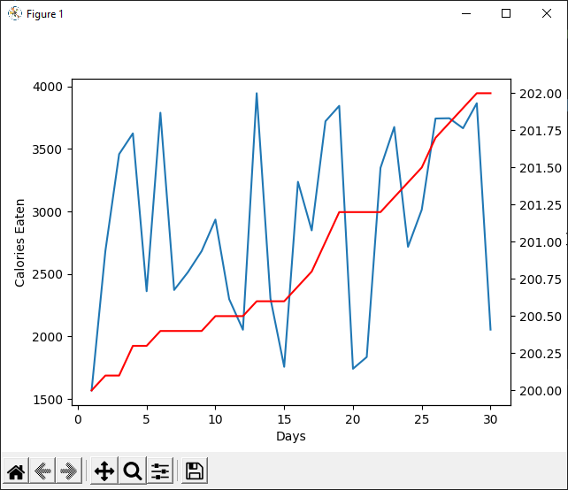

# `matplotlib` Demo

An example of using matplotlib in python.

This shows a plot with two Y axes, one for calories consumed and another for weight over a period of 30 days. The weight is calculated as a function of calories eaten.

